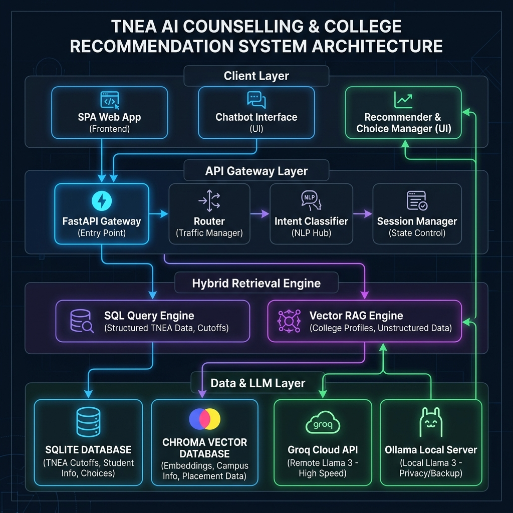

<p align="center">
  
</p>

<h1 align="center">🎓 TNEA Pro AI — Intelligent Counselling & College Recommendation System</h1>

<p align="center">
  <b>An AI-powered assistant for Tamil Nadu Engineering Admissions (TNEA) that combines RAG-based Q&A with structured SQL analytics to deliver personalized college recommendations, cutoff insights, and counselling strategy.</b>
</p>

<p align="center">
  
  
  
  
  
  
</p>

---

## ✨ Features

| Feature | Description |
|---|---|
| 🤖 **AI Counselling Expert** | Conversational chatbot powered by Groq (Llama-3.3-70b) with Ollama fallback. Understands TNEA process, fees, scholarships, and strategy. |
| 🧮 **Cutoff Calculator** | Compute your TNEA cutoff instantly using the official formula: `Maths + (Physics / 2) + (Chemistry / 2)`. Features automatic AI eligibility analysis and seamless "Find Colleges" transition. |
| 🏫 **College Finder** | Enter your cutoff, category, district & branch — get colleges categorized as **Safe**, **Moderate**, or **Dream** based on 5 years of cutoff history (2021–2025). |
| 📚 **RAG Pipeline** | Ingests TNEA brochures, PDFs, and policy documents into ChromaDB. Retrieves relevant context for every query using `all-MiniLM-L6-v2` embeddings. |
| 📖 **College Directory** | Searchable directory of all TNEA colleges with branch-wise cutoff ranges. Supports district/branch filtering, pagination (50 per page), and detailed college profiles with trends. |
| 📋 **Choice List Builder** | Bookmark colleges from recommendations or the directory into a personal choice list. Export as PDF/CSV/Clipboard for final TNEA option filling. |
| 📍 **TFC Center Locator** | Find TNEA Facilitation Centers by district with coordinator names and contact info. |
| 🌙 **Dark / Light Mode** | Premium UI with glassmorphism, smooth animations, and responsive design for mobile & desktop. |

---

## ⚡ Performance & Optimization Features

To ensure a seamless and low-latency user experience under load, we implemented several performance-oriented features:
* **Paginated Loading**: Replaced full directory loads with paginated search. The College Directory loads colleges in batches of 50 per page, reducing page loading latency by 90%+.
* **Response Caching**: Backend database queries for the directory are cached using an in-memory TTL (Time-To-Live) cache (5 minutes), avoiding redundant aggregations on SQLite.
* **Client-side Request Aborting & Debouncing**: Utilizes `AbortController` to cancel stale in-flight requests and a burst-guard lock (80ms debounce) to prevent duplicate backend requests during quick interactions.
* **HTTP Caching**: Responses from the directory endpoint include `Cache-Control: public, max-age=60` headers, allowing the browser to cache queries.
* **Glitch-Free Routing**: Fixed state preservation issues, ensuring seamless navigation from the calculator to directory and vice-versa without resetting user query parameters or causing page flashes.

---

## 🏗️ Architecture

```
┌─────────────────────────────────────────────────────────────┐
│                        Frontend                             │
│          HTML + CSS + JavaScript (Vanilla)                   │
│   Chat UI · College Finder · Directory · Choice List · TFC  │
│   Cutoff Calculator (Direct Routing & Prefill Finder)        │
└───────────────────────┬─────────────────────────────────────┘
                        │  REST API
┌───────────────────────▼─────────────────────────────────────┐
│                   FastAPI Backend                            │
│                                                             │
│  ┌──────────────┐  ┌──────────────┐  ┌───────────────────┐  │
│  │  /chat (RAG) │  │ /recommend   │  │ /directory, /tfc  │  │
│  │  + SQL merge │  │ Tier Engine  │  │ /college/:code    │  │
│  └──────┬───────┘  └──────┬───────┘  └───────┬───────────┘  │
│         │                 │                  │              │
│  ┌──────▼───────┐  ┌──────▼───────┐  ┌───────▼───────────┐  │
│  │  ChromaDB    │  │   SQLite     │  │  SQLite (TFC)     │  │
│  │ (Vector DB)  │  │ (Cutoffs)    │  │  (Centers)        │  │
│  └──────────────┘  └──────────────┘  └───────────────────┘  │
│         │                                                   │
│  ┌──────▼───────────────────────────────────────┐           │
│  │  LLM: Groq (Llama-3.3-70b) → Ollama (phi3)  │           │
│  └──────────────────────────────────────────────┘           │
└─────────────────────────────────────────────────────────────┘
```

---

## 🛠️ Tech Stack

| Layer | Technology |
|---|---|
| **Backend** | FastAPI, SQLAlchemy, Pydantic |
| **Frontend** | Vanilla HTML/CSS/JS, Outfit + Inter fonts, Font Awesome |
| **LLM** | Groq Cloud (Llama-3.3-70b-versatile) with Ollama (phi3) fallback |
| **Vector DB** | ChromaDB with LangChain integration |
| **Structured DB** | SQLite (colleges + TFC centers) |
| **Embeddings** | `sentence-transformers/all-MiniLM-L6-v2` (CPU) |
| **Document Parsing** | LangChain, PyPDF, Tesseract OCR, pdf2image |
| **Containerization** | Docker & Docker Compose |

---

## 🚀 Production Deployment & Scaling (1000+ Concurrent Users)

If you plan to deploy this application to production to support **1000+ concurrent users**, the current architecture (SQLite + Groq free tier + local memory cache) will need to be scaled. Here is the recommended migration path:

### 1. Database Layer: Migrate from SQLite to PostgreSQL
SQLite is fantastic for development, but it uses a file-level database lock. When multiple users write to the database (e.g., choice list operations or high-frequency analytics), queries will block, leading to timeouts.
- **Action**: Migrate to a managed PostgreSQL cluster (e.g., AWS RDS PostgreSQL, Supabase, or PostgreSQL Docker container).
- **Benefit**: Handles thousands of concurrent read/write connections with connection pooling (e.g., `pgBouncer`).

### 2. Application Scaling: ASGI Servers & Load Balancing
Currently, running `uvicorn --reload` runs a single python process. It cannot utilize multi-core CPUs.
- **Action**: Run the FastAPI application using **Gunicorn** with multiple **Uvicorn workers**:
  ```bash
  gunicorn -w 4 -k uvicorn.workers.UvicornWorker backend.app.main:app
  ```
  *(Rule of thumb: `workers = (2 * CPU cores) + 1`)*
- **Load Balancer**: Deploy behind an **Nginx** reverse proxy or a Cloud Load Balancer (AWS ALB, Cloudflare) to distribute traffic across multiple container instances.

### 3. Caching Layer: Migrate to Redis
Our current TTL cache is stored in FastAPI's local process memory. In a multi-worker or multi-server deployment, workers cannot share this cache.
- **Action**: Use **Redis** as a centralized caching server for both API responses and rate limiting.
- **Benefit**: Shared cache state across all backend workers, preventing duplicate DB queries, and enabling session/state sharing if required.

### 4. LLM API Rate Limits
The free tier of the Groq API has low rate limits (~30 requests per minute) and will fail under load.
- **Action**: 
  - Upgrade to Groq's paid production tier to increase Rate Limit (RPM/TPM).
  - Implement LLM request queuing or background processing (e.g., using **Celery** with Redis/RabbitMQ) for intensive operations.
  - Set up a fallback load-balancer between multiple LLM providers (e.g., Groq, OpenAI, Anthropic, or self-hosted Llama-3 via vLLM on cloud GPUs).

### 5. Static Assets Delivery
Serving frontend static files (HTML, CSS, JS) directly from FastAPI consumes backend resources.
- **Action**: Serve the `frontend/` directory via a **CDN (like Cloudflare, AWS CloudFront)** or configure **Nginx** to serve them directly without passing the request to the FastAPI application.

---

## 📦 Getting Started

### Prerequisites

- **Python 3.10+**
- **Groq API Key** — [Get one free at groq.com](https://console.groq.com)
- *(Optional)* [Ollama](https://ollama.ai/) for local LLM fallback
- *(Optional)* [Docker](https://www.docker.com/) for containerized deployment

### 1. Clone the repository

```bash
git clone https://github.com/DhanushN2005/Tnea_Counseling-.git
cd Tnea_Counseling-
```

### 2. Set up environment variables

Create a `.env` file in the project root:

```env
GROQ_API_KEY=your_groq_api_key_here
```

### 3. Install dependencies

```bash
pip install -r requirements.txt
```

### 4. Seed the database

```bash
python -m scripts.seed_db
```

### 5. Ingest documents into ChromaDB

Place your TNEA PDFs and brochures in `backend/data/docs/`, then run:

```bash
python -m scripts.ingest_docs
```

### 6. Start the server

```bash
uvicorn backend.app.main:app --reload
```

Open [http://localhost:8000](http://localhost:8000) in your browser — the frontend is served automatically.

---

### 🐳 Running with Docker

```bash
docker-compose up --build
```

> **Note:** If using Ollama as a fallback, ensure the Ollama service is running on your host. Docker is configured to connect via `host.docker.internal`.

---

## 📡 API Reference

| Method | Endpoint | Description |
|---|---|---|
| `POST` | `/chat` | AI chatbot with RAG + SQL context. Accepts `query`, `cutoff`, `category`, `session_id`. |
| `POST` | `/recommend` | College recommendations. Accepts `cutoff`, `category`, `district`, `branch`. Returns tiered results. |
| `GET` | `/directory` | Searchable college directory. Accepts `search`, `districts[]`, `branches[]`, `page`, `limit`. |
| `GET` | `/metadata` | Fetch all unique districts and branches for multi-select filters. |
| `GET` | `/college/{code}` | Detailed college profile with branch-wise cutoff history (2021–2025). |
| `GET` | `/tfc` | List of TNEA Facilitation Centers with contact details. |
| `POST` | `/choice/add` | Add a college to the user's choice list. |
| `POST` | `/choice/remove` | Remove a college from the choice list. |
| `GET` | `/choice/{session_id}` | Get the user's saved choice list. |
| `GET` | `/health` | Health check endpoint. |

---

## 📂 Project Structure

```
Tnea_Counseling-/
├── backend/
│   ├── app/
│   │   ├── main.py              # FastAPI app — all routes, RAG + SQL logic, LLM calls
│   │   └── database.py          # SQLAlchemy models (College, TFCCenter)
│   └── data/
│       ├── db/
│       │   └── chroma_db/       # ChromaDB vector store (auto-generated)
│       └── docs/                # Source PDFs, brochures, and JSON cutoff data
├── frontend/
│   ├── index.html               # Single-page app with sidebar navigation
│   ├── style.css                # Premium dark/light theme with glassmorphism
│   └── script.js                # Client-side logic — chat, finder, directory, choices
├── scripts/
│   ├── seed_db.py               # Seed SQLite with college & TFC data
│   ├── ingest_docs.py           # Parse PDFs → ChromaDB embeddings
│   ├── ingest_json_cutoff.py    # Ingest structured JSON cutoff data
│   ├── master_sync.py           # Full data sync pipeline
│   └── ...                      # Additional utility scripts
├── .env                         # API keys (git-ignored)
├── .gitignore
├── requirements.txt
├── docker-compose.yml
├── backend.Dockerfile
└── README.md
```

---

## 🧠 How It Works

1. **User asks a question** → The system detects intent (college lookup, fees, scholarships, process, etc.)
2. **Dual retrieval** → Relevant records are fetched from both **SQLite** (structured cutoff data) and **ChromaDB** (unstructured PDF knowledge)
3. **Context composition** → SQL results + vector search results are merged into a rich context
4. **LLM generation** → The context is sent to **Groq Llama-3.3-70b** (or Ollama phi3 fallback) with an expert counsellor persona
5. **Structured response** → The answer is returned with sources, strategy alerts, and actionable next steps

For the **College Finder**, the recommendation engine compares the user's cutoff against 5 years of historical data and classifies each college-branch pair into:
- 🟢 **Safe** — High probability of admission
- 🟡 **Moderate** — Good match, worth prioritizing
- 🔴 **Dream** — Aspirational reach, worth trying in early rounds

---

## 🤝 Contributing

1. Fork the repository
2. Create a feature branch (`git checkout -b feature/amazing-feature`)
3. Commit your changes (`git commit -m 'Add amazing feature'`)
4. Push to the branch (`git push origin feature/amazing-feature`)
5. Open a Pull Request

---

## 📄 License

This project is open source and available under the [MIT License](LICENSE).

---

<p align="center">
  Built with ❤️ for TNEA aspirants by <a href="https://github.com/DhanushN2005">DhanushN2005</a>
</p>